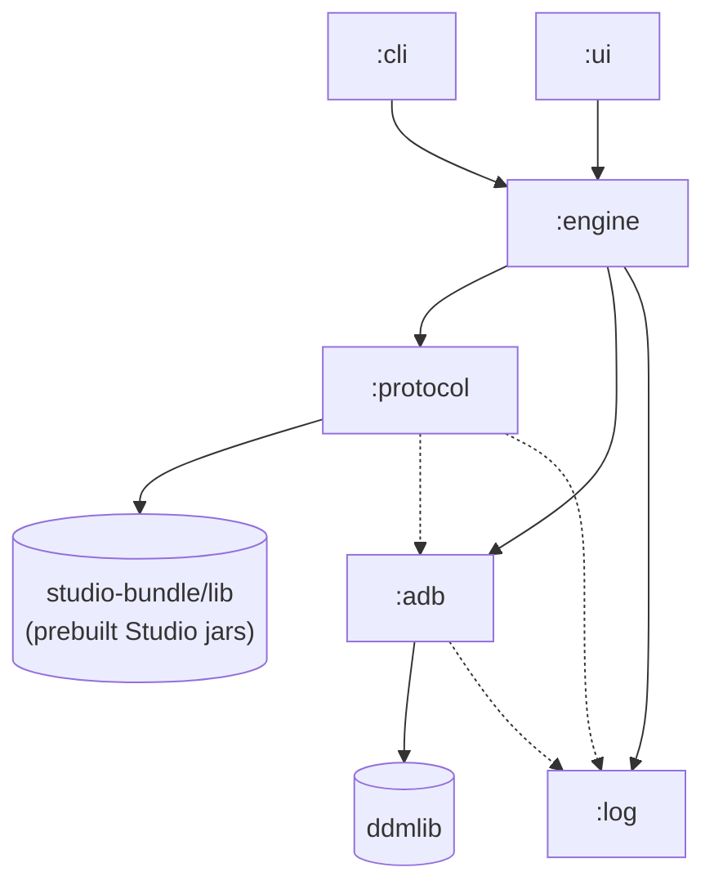

# android-network-inspector

A standalone macOS app that captures Android app network traffic — HTTP/HTTPS via `HttpURLConnection` and OkHttp, plus gRPC — by piggybacking on Android Studio's Network Inspector device-side agents over `adb`.

Decrypted (plaintext) traffic, response/request bodies, headers, and gRPC frames are intercepted via JVMTI bytecode rewriting inside the target app's ART runtime, exactly the way Studio does it. No certificate pinning gymnastics, no app SDK integration.

## Status

Proof-of-concept. End-to-end attach works against debuggable apps on emulator and physical devices. UI shows the live request table, headers/body detail, intercept rules. Hardening, polish, and broader device coverage are next.

## How it works

```
[macOS app]                                  [Android device]
                                                                           
DeviceChooser           ddmlib over adb       transport daemon (perfd)
PackageDropdown   ───────── push ──────────►  /data/local/tmp/perfd/
ColdStart/AttachRunning                       
                                                                           
                  am attach-agent / am start
                  ──────────────────────────► JVMTI Agent_OnAttach
                                              libjvmtiagent_<abi>.so
                                              ClassFileLoadHook
                                              + RetransformClasses
                                                                           
                  adb forward tcp:N           
                    localabstract:            
                    AndroidStudioTransport    
                                                                           
gRPC TransportService                         hooks installed on:
  Execute(ATTACH_AGENT)    ─────────────►    URL.openConnection
  Execute(CreateInspector) ─────────────►    OkHttpClient.networkInterceptors
  Execute(StartInspection) ─────────────►    ManagedChannelBuilder.forAddress
  GetEvents (server stream) ◄─────── events  
                                                                           
RowAggregator      ◄── NetworkInspectorProtocol.Event ── inspector dex
Compose RequestTable
```

The device-side binaries (`transport`, `libjvmtiagent.so`, `perfa.jar`, `network-inspector.jar`) are **not** committed to this repository. They are extracted from your local Android Studio installation at build time by the `syncStudioBundle` Gradle task.

## Requirements

- macOS (Apple Silicon or Intel)
- JDK 21 (the Gradle daemon is pinned to this in `gradle.properties` — adjust if needed)
- Android Studio installed locally (Meerkat or newer recommended)
- `adb` on `PATH` (`brew install --cask android-platform-tools` or via Studio SDK)
- An Android emulator or physical device with API 26+
- Target app must be **debuggable** (`android:debuggable="true"`)

## Setup

```bash
git clone https://github.com/jisungbin/android-network-inspector
cd android-network-inspector

# 1) Extract the Studio device-side assets into studio-bundle/.
#    Edit android.studio.path in gradle.properties if your Studio lives elsewhere.
./gradlew syncStudioBundle

# 2a) Launch the GUI
./gradlew :ui:run

# 2b) Or build the CLI
./gradlew :cli:installDist
./cli/build/install/cli/bin/cli list-devices
./cli/build/install/cli/bin/cli attach \
  --device <serial> \
  --package com.example.app \
  --activity com.example.app/.MainActivity
```

## Install locally as a `.app`

For day-to-day use you can drop a self-contained `.app` bundle into `/Applications` and launch it from Spotlight instead of running Gradle every time:

```bash
./gradlew syncStudioBundle           # one-time: extract Studio device-side jars
./gradlew :ui:createDistributable    # build the .app bundle
cp -R "ui/build/compose/binaries/main/app/Network Inspector.app" /Applications/
```

After that, open it from Spotlight (`Network Inspector`) or `/Applications`. The bundle ships its own JRE, so no system Java is needed at runtime.

The `.app` is **machine-local**: the Studio bundle path is baked into the launch args as an absolute path at build time (see `ui/build.gradle.kts`), so the bundle only runs on the same Mac it was built on. If you move it to another machine, run `syncStudioBundle` + `createDistributable` again there.

If you prefer a DMG installer instead:

```bash
./gradlew :ui:packageDmg
# Output: ui/build/compose/binaries/main/dmg/
```

## Usage (GUI)

1. **Refresh** — populate the device dropdown
2. **Device** — pick the emulator/device
3. **Package** — search and pick a third-party app (auto-detects whether it is running)
4. **Mode** — `Cold start` (force-stop and relaunch, most stable) or `Attach running` (live-attach to an existing PID, API 28+)
5. **Activity** — auto-resolved on package select; edit only if you need a non-launcher entry point
6. **Attach**

The Inspector screen shows the live request table. Selecting a row opens the request/response panel with headers and a body viewer (gzip auto-decoded, text/binary auto-detected). The right panel also hosts Intercept Rules — match a URL pattern and replace status code / body.

## Limitations

- **Debuggable APKs only.** Release builds reject `am attach-agent`.
- **R8-stripped OkHttp/HttpURLConnection bypasses interception.** If the inspector class is gone, hooks can't be installed.
- **Apps with their own JVMTI agent may conflict** (e.g. some hot-swap or RASP tooling). Tombstones with `SEGV` inside `libjvmtiagent.so` on `Agent_OnAttach` are the usual symptom — try cold-start mode first, or test against a clean sample app.
- Tracks all traffic from the moment of attach; pre-attach requests are not captured.

## Troubleshooting

A rolling log file is written to `~/Desktop/network-inspector.log`. Every adb shell command, attach step, gRPC event, and failure stack trace lands there. When something is wrong, that file is the first thing to read.

Common gotchas already handled by this app:

- adb forward IPv4-only — gRPC client uses `127.0.0.1` instead of `localhost`
- ddmlib `executeShellCommand` 2-arg default timeout (5s) kills the long-lived transport daemon — we use the 5-arg overload with `Long.MAX_VALUE`
- `nohup` / `setsid` cannot keep the daemon alive against `adbd`'s shell-cleanup semantics — we keep an `executeShellCommand` call blocking on a dedicated thread instead
- `perfa.jar` must live in the app's `code_cache/` (not just in `/data/local/tmp/perfd/`) or `Agent_OnAttach` crashes
- `pgrep -f` matches the calling shell — `pidof <name>` is reliable

If attach fails, scroll to the bottom of the log file — the diagnose block printed there includes `ls -la /data/local/tmp/perfd/`, the foreground transport run output, and a filtered `logcat` excerpt.

## Architecture (modules)

| Module | Responsibility |
|---|---|
| `:log` | `DiskLogger` only (rolling disk log at `~/Desktop/network-inspector.log`) |
| `:adb` | ddmlib wrappers: device + shell + sync + port forward + pid lookup |
| `:protocol` | Studio prebuilt jars + gRPC `TransportClient` + `Configs` + Inspector command builders + `RuleSender`. **Only module #2 proto self-build migration will touch.** |
| `:engine` | orchestration + domain: `AgentDeployer`, `DaemonRunner`, `AgentAttacher`, `AttachOrchestrator`/`AttachSession`, `NetworkRow`, `RowAggregator`, `NetworkEventRenderer` |
| `:cli` | command-line entry point (`list-devices`, `attach`) |
| `:ui` | Compose Desktop GUI (Home + Inspector screens, intercept rules) |

Dependency direction (solid = `api`, dotted = `implementation`):



## Acknowledgments

This project is glue around Android Studio's Network Inspector. All the heavy lifting — JVMTI agent, transport daemon, network inspector dex, and the protobuf schemas — comes from AOSP `tools/base` and is licensed Apache 2.0. This wrapper layer is the part that lives in this repository.

## License

Apache License 2.0, matching the upstream AOSP assets it relies on.
